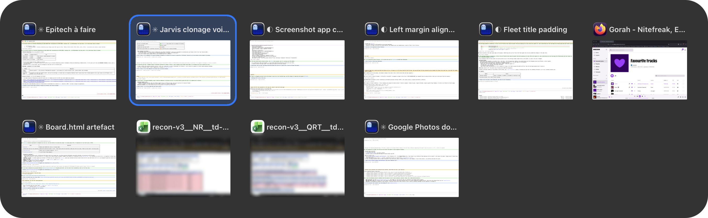

# my-lab

Little apps made for my needs. Each one is a folder at the root of this repo, and each one
runs on my Mac today.

## Using one

```sh
git clone https://github.com/anpawo/my-lab.git && cd my-lab/<app>
./install.sh
```

`install.sh` builds the app, copies it to `~/Applications` and registers a launchd agent so it
starts with your session. All it needs is a Swift toolchain and the Command Line Tools, no
Xcode. Written for macOS on Apple Silicon. MIT, see [`LICENSE`](LICENSE).

**If you took one home, leave a star.** It is the only signal I get that any of this was
useful to someone else.

## The apps

Click a name to unfold its README.

<!-- apps:start -->
<details>
<summary><b>alt-tab</b></summary>

# alt-tab

A replacement for the ⌘Tab switcher of macOS: one tile per window, each with a picture of
itself.

The switcher that ships with macOS gets three things wrong:

- **Finder is always in it**, even with no Finder window open — a slot spent on something you
  never switch to.
- **It switches applications, not windows.** Two windows of the same app are one icon; you land
  on the app and are left to find which window you meant.
- **It shows the app's icon**, not what is in the window.

alt-tab lists windows instead: every window on the desktop you are looking at, in
most-recently-used order, each with its own title and a small picture of itself. An app with no
window open is not in the list, Finder included.

Hold the modifier and press Tab. Let it go and you are there. That is the whole product.



**It starts on ⌥Tab, and takes ⌘Tab when you tell it to.** The Dock consumes ⌘Tab before any
application sees it, so holding that chord means switching Apple's switcher off — and that
setting outlives the app that changed it. A default that did so would take the machine's
switcher away from someone who asked for nothing. So a fresh install starts on a chord nobody
owns: both switchers are there, you use one and then the other on the same desktop, and you
decide.

Once you have decided, **the settings give it ⌘Tab**. alt-tab then switches the system chord
off while it holds it, and hands it back when you quit it or run `./uninstall.sh`. If a crash
ever leaves you without one, `alt-tab --restore-hotkeys` returns it, and it works with no GUI
at all.

## Install

**Download** [the latest release](https://github.com/anpawo/my-lab/releases?q=alt-tab), unzip
it, and move `Alt-tab.app` to `~/Applications`.

macOS will refuse to open it the first time: the release is signed ad-hoc, which is what an
app signed by nobody looks like. Open it once, then go to **System Settings → Privacy &
Security → Open Anyway**; before macOS 15, right-click it → Open does the same. You only do
this once.

Then open the app. It puts up its settings window, where you can tick **Start at login**.

**Or build it yourself**, which is the better option on your own machine — see below. A local
build can be signed with a certificate of your own, and macOS then keeps the Accessibility
grant across rebuilds instead of asking again every time.

```sh
git clone https://github.com/anpawo/my-lab.git && cd my-lab/alt-tab
./install.sh
```

`install.sh` builds the app, installs it to `~/Applications`, and registers a LaunchAgent so it
starts with your session.

## Permissions

Two, and the app is honest about both — the settings window says which are missing and takes
you to the right pane.

- **Accessibility** is required. Without it alt-tab can read no window titles and raise no
  windows, so the panel lists applications and does nothing when you let ⌥ go.
- **Screen Recording** is optional. Without it there are no pictures of windows, only
  application icons. Everything else works.

macOS answers the Screen Recording question once per launch, so pictures start appearing after
you quit and reopen the app — not the moment you grant it.

## Using it

| | |
|---|---|
| **⌥Tab** | open the switcher, and step through the windows — or whatever chord you bound |
| **let ⌥ go** | switch to the selected window |
| **← →** | step back or forward, with ⌥ still held |
| **Escape** | change your mind |
| **click a tile** | switch to that window — with ⌥ still held, since letting go ends the session |
| **click the red cross** | close that window |

**Six tiles to a row, then a new row.** A long list on one row shrinks every picture until it
stops saying which window it is, so the panel wraps instead, and only gives tiles back their
size when the rows themselves no longer fit the height of the screen. Every tile is the same
size — cut to the widest picture on show — and a window narrower than that keeps its own
picture, centred, with the spare room around it rather than stretched to fill. A last row that
is short starts at the left, where the row above it started.

A ⌥Tab faster than the panel's delay switches without drawing anything at all. The delay is a
slider in the settings; 100 ms by default, and 0 means the panel always appears.

Minimized windows, and the windows of hidden applications, are in the list — at the end, since
a window in the Dock has no place in a most-recently-used order. They carry a mark in their
title line and show the last picture taken of them, or the application's icon. Both kinds can
be switched off in the settings.

alt-tab has no Dock icon and no menu bar icon. Opening the application is what opens its
settings, and the ⇥ icon appears in the menu bar while that window is up. Tick the box to keep
it there.

## Building

```sh
python3 build.py                  # universal (Apple Silicon and Intel), into ./dist
python3 build.py --arch native    # only this machine's architecture — about twice as fast
python3 build.py --adhoc --zip    # what a downloadable release is made of
```

No dependencies beyond a Swift toolchain and the Command Line Tools; the script uses nothing
but the Python standard library, and it never touches the network.

Two things worth knowing.

**Universal builds are two builds.** Swift Package Manager can only produce more than one
architecture in a single pass through Xcode's XCBuild, which a machine with only the Command
Line Tools does not have. So `build.py` compiles each architecture separately and `lipo`s them
together. Use `--arch native` while you are working.

**The signature decides whether macOS remembers your permission.** The Accessibility grant is
tied to the signing identity. An ad-hoc signature has no identity — its fingerprint is a hash
of the binary — so every rebuild is a new app as far as macOS is concerned, and it asks again.
Run `./make-signing-identity.sh` once to create a local self-signed certificate; `build.py`
picks it up automatically from then on. Anything published has to be ad-hoc regardless, since
that certificate is trusted nowhere but here.

```sh
swift run check     # the test suite: the window filter, the state machine, the shortcut model
./uninstall.sh      # removes the app, the LaunchAgent and the log
```

### Looking at the panel without opening it

The panel can be laid out, and even photographed, without ever being put on the screen — which
matters when the screen belongs to someone in the middle of something else.

```sh
alt-tab --render                          # the window list, then where every tile landed
alt-tab --render --windows=14             # the same, with the list padded out to 14 tiles
alt-tab --render --shot=docs/panel.png    # the panel as a PNG, pictures and all
alt-tab --render --demo --shot=docs/panel.png   # the whole screen, with invented windows
```

All of them build the real panel and run the real layout; none orders the window in. Without
`--demo` the windows in the picture are whatever is open at the time, which is someone's work;
`--demo` swaps them for apps everyone has, titles that belong to no one and hand-drawn
pictures. The picture at the top of this page is neither: it is a screenshot of the switcher
in use, edited afterwards — the private windows taken out, the rest moved up to fill their
places, and a stock wallpaper put behind it.

## What it does not do

It switches windows on the desktop you are looking at. It does not do Spaces other than the
current one, applications without windows, alphabetical ordering, per-application rules,
searching, or a reverse shortcut. If you want those, [AltTab][alttab] has spent
years on them and does them well — this is the small version of that idea, built to be read
in an afternoon.

[alttab]: https://alt-tab-macos.netlify.app

## Licence

MIT.

</details>

<details>
<summary><b>screenshot</b></summary>

# mr. screenshot

A ⌘⇧5 replacement for macOS: the same bar, the same six modes, and a file that is on disk the
moment you click, not five seconds later.


Press ⌘⇧5. The screen freezes and dims, the bar comes up at the bottom, and you pick what to
take: the entire screen, a window, or a portion you drag out — as a still or as a recording.


- **Entire Screen** — everything stays dimmed, framed in white along the display's round corners.
- **Selected Window** — no dimming: the window under the pointer turns light blue in a white
  frame, and the highlight stops where another window sits in front of it.
- **Selected Portion** — the screen is dimmed except the box you drag, with its handles and its
  size in pixels.

The recordings show the same thing for the same targets.


Hovering a button names its mode, with none of a tooltip's delay:


Pick a recording and the button says so:


- **Keys.** ⌘← ⌘→ step through the modes, the arrows nudge the selection (⇧ by 10, ⌥ resizes),
  Return takes it, Escape closes. ⌘⇧5 again flips between still and recording, and stops a
  recording that is running.
- **After the shot.** A thumbnail sits in the corner for eight seconds: its left half pins, its
  right half deletes, a drag takes the file with it.
  A pinned capture stays in the top-right corner: a click copies it, a double click opens the
  file, a right click unpins it.
- **Nothing in the menu bar.** It runs as a LaunchAgent, invisible, and only answers ⌘⇧5.

## Options

The Options menu, from top to bottom:

- **Save to** — Desktop, Downloads, Documents, Clipboard, Other Folder…; several can be on at once.
- **Timer** — None, 5 Seconds, 10 Seconds.
- **Options** — Show Floating Thumbnail, Show Mouse Pointer, and Record Microphone in the
  recording modes.

The same settings are `defaults write com.mr.screenshot <key> <value>`.

## Install

**Download** [the latest release](https://github.com/anpawo/my-lab/releases?q=screenshot),
unzip it, and move `mr. screenshot.app` to `~/Applications`. Apple Silicon only.

macOS will refuse to open it the first time: the release is signed ad-hoc, which is what an
app signed by nobody looks like. Open it once, then go to **System Settings → Privacy &
Security → Open Anyway**. Opened by hand it runs until you log out; building it with
`./install.sh`, below, is what makes it start at login.

## Build

Swift, Command Line Tools only — no Xcode.

```sh
./install.sh             # builds, installs to ~/Applications, starts it at login
swift run -c release check
./build.sh --release     # ad-hoc and zipped: what a download is made of
```

Turn the system's own ⌘⇧5 off first: System Settings → Keyboard → Keyboard Shortcuts →
Screenshots. The app needs Screen Recording, and asks for it the first time.

The pictures above are drawn by the app's own views, offscreen, over a stock wallpaper and stand-in windows:
`.build/release/screenshot --render-docs docs`. The bar is drawn flat there: the blur of the
desktop behind it only exists on screen.

</details>
<!-- apps:end -->
