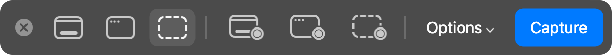

# mr. screenshot

A ⌘⇧5 replacement for macOS: the same bar, the same six modes, and a file that is on disk the
moment you click, not five seconds later.


Press ⌘⇧5. The screen freezes and dims, the bar comes up at the bottom, and you pick what to
take: the entire screen, a window, or a portion you drag out — as a still or as a recording.



Hovering a button names its mode, with none of a tooltip's delay:


Pick a recording and the button says so:


- **Keys.** ⌘← ⌘→ step through the modes, the arrows nudge the selection (⇧ by 10, ⌥ resizes),
  Return takes it, Escape closes. ⌘⇧5 again flips between still and recording, and stops a
  recording that is running.
- **After the shot.** A thumbnail sits in the corner for five seconds, with Pin and Delete.
  A pinned capture stays in the top-right corner until you close it.
- **Recent.** The menu-bar icon keeps the last 20 captures, whatever folder they went to.

## Options

The Options menu, from top to bottom:

- **Save to** — Desktop, Downloads, Documents, Clipboard, Other Folder…; several can be on at once.
- **Timer** — None, 5 Seconds, 10 Seconds.
- **Options** — Show Floating Thumbnail, Show Mouse Pointer, and Record Microphone in the
  recording modes.

The same settings are `defaults write com.mr.screenshot <key> <value>`.

## Build

Swift, Command Line Tools only — no Xcode.

```sh
./install.sh             # builds, installs to ~/Applications, starts it at login
swift run -c release check
```

Turn the system's own ⌘⇧5 off first: System Settings → Keyboard → Keyboard Shortcuts →
Screenshots. The app needs Screen Recording, and asks for it the first time.

The pictures above are drawn by the app's own views, offscreen, over a stock wallpaper:
`.build/release/screenshot --render-docs docs`. The bar is drawn flat there: the blur of the
desktop behind it only exists on screen.
