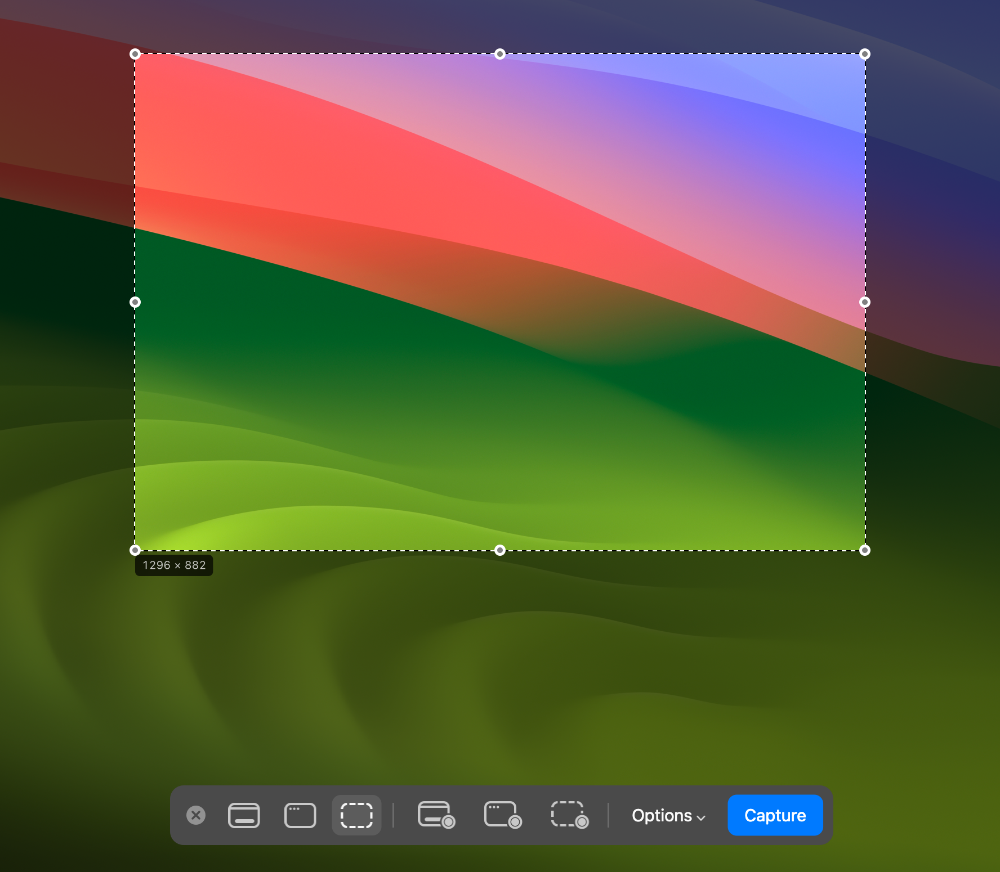
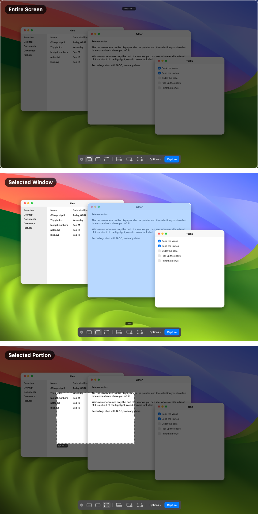
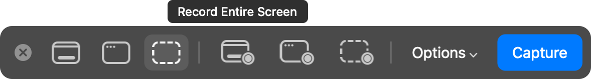

# mr. screenshot

A ⌘⇧5 replacement for macOS: the same bar, the same six modes, and a file that is on disk the
moment you click, not five seconds later.



Press ⌘⇧5. The screen freezes and dims, the bar comes up at the bottom, and you pick what to
take: the entire screen, a window, or a portion you drag out — as a still or as a recording.



- **Entire Screen** — everything stays dimmed, framed in white along the display's round corners.
- **Selected Window** — no dimming: the window under the pointer turns light blue in a white
  frame, and the highlight stops where another window sits in front of it.
- **Selected Portion** — the screen is dimmed except the box you drag, with its handles and its
  size in pixels.

The recordings show the same thing for the same targets.


Hovering a button names its mode, with none of a tooltip's delay:



Pick a recording and the button says so:


- **Keys.** ⌘← ⌘→ step through the modes, the arrows nudge the selection (⇧ by 10, ⌥ resizes),
  Return takes it, Escape closes. ⌘⇧5 again flips between still and recording, and stops a
  recording that is running.
- **After the shot.** A thumbnail sits in the corner for eight seconds: its left half pins, its
  right half deletes, a drag takes the file with it.
  A pinned capture stays in the top-right corner: a click copies it, a double click opens the
  file, a right click unpins it.
- **Nothing in the menu bar.** It runs as a LaunchAgent, invisible, and only answers ⌘⇧5.

## Options

The Options menu, from top to bottom:

- **Save to** — Desktop, Downloads, Documents, Clipboard, Other Folder…; several can be on at once.
- **Timer** — None, 5 Seconds, 10 Seconds.
- **Options** — Show Floating Thumbnail, Show Mouse Pointer, and Record Microphone in the
  recording modes.

The same settings are `defaults write com.mr.screenshot <key> <value>`.

## Install

**Download** [the latest release](https://github.com/anpawo/my-lab/releases?q=screenshot),
unzip it, and move `mr. screenshot.app` to `~/Applications`. Apple Silicon only.

macOS will refuse to open it the first time: the release is signed ad-hoc, which is what an
app signed by nobody looks like. Open it once, then go to **System Settings → Privacy &
Security → Open Anyway**. Opened by hand it runs until you log out; building it with
`./install.sh`, below, is what makes it start at login.

## Build

Swift, Command Line Tools only — no Xcode.

```sh
./install.sh             # builds, installs to ~/Applications, starts it at login
swift run -c release check
./build.sh --release     # ad-hoc and zipped: what a download is made of
```

Turn the system's own ⌘⇧5 off first: System Settings → Keyboard → Keyboard Shortcuts →
Screenshots. The app needs Screen Recording, and asks for it the first time.

The pictures above are drawn by the app's own views, offscreen, over a stock wallpaper and stand-in windows:
`.build/release/screenshot --render-docs docs`.
